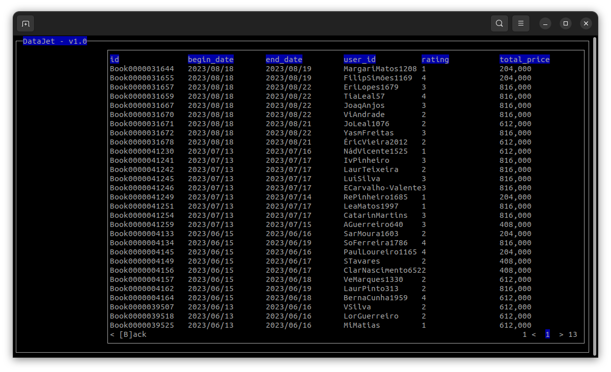

Implementation of a database of travel records, such as flights, reservations and users in C using [GLib](https://docs.gtk.org/glib/)! Developed as a project for the IT Laboratories III (Laboratórios de Informática III) class, part of the second year's curriculum of the Software Engineering bachelor's degree at University of Minho.

This project obtained a final grade of **19/20** 💎



The main goal of the project was to implement object-oriented programming principles, such as encapsulation and modularity while also developing efficient data structures for fast, performant database querying. 

The project has two modes: **batch**, where the program receives the dataset path and an input file with a list of command queries to be executed; and **interactive**, a GUI-based database querying application.

## Setup  ⚙️

*All commands have to be executed inside the* `trabalho-pratico` *directory.*

To build the project:
```bash
$ make
```
To run the project in **interactive** mode:
```bash
$ ./programa-principal
```

To run the project in **batch** mode:
```bash
$ ./programa-principal <dataset-path> <commands-input>
```

This project requires [GLib](https://docs.gtk.org/glib/) and the [ncurses](https://invisible-island.net/ncurses/) library (installation example for a debian based system):

```bash
$ sudo apt-get install libglib2.0-dev libncurses-dev
```

## Group 👥

- **A104100** [Hélder Ricardo Ribeiro Gomes](https://github.com/helderrrg)
- **A104356** [João d'Araújo Dias Lobo](https://github.com/joaodiaslobo)
- **A104439** [Rita da Cunha Camacho](https://github.com/ritacamacho)
